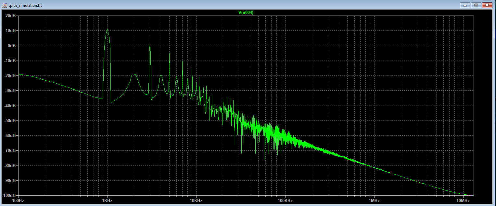
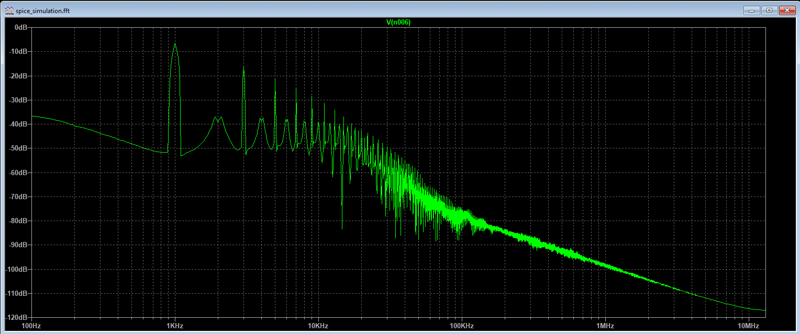

# Distortion Pedal Using JUCE

Thanks for lassandroan for the pedal design https://github.com/lassandroan/juce-pedal-demo

## Description

Using circute analyze of https://www.electrosmash.com/mxr-distortion-plus-analysis  

## Calculations

### Calculation of the Distortion Section

### Calculation of the Clipping Section

## Spice Simualtion
### spice_simulation_distortion_pot_min
### spice_simulation_distortion_pot_max

#### Distortion FFT

#### Out FFT

## Matlab Simulation
### matlab_simulation_distortion_pot_min
  
### matlab_simulation_distortion_pot_max

## License
[MIT License](https://opensource.org/licenses/MIT)